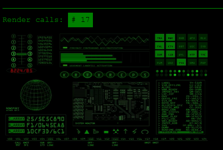

# InfrontJS - Official Examples

Learning by example is always a good choice. This is the official InfrontJS examples repository.

    
    
    
    

Feel free to browse through the example codes.

### [View Examples Online](https://examples.infrontjs.com) &middot; [Homepage](https://www.infrontjs.com) &middot; [ApiDocs](https://apidocs.infrontjs.com) &middot; [Guides](https://guides.infrontjs.com) &middot; [Twitter](https://twitter.com/infrontjs)

## Build

Build online version locally:

1. `npm install`
2. `npm build`
3. Open `dist/index.html`

## Contributing

By contributing or commenting on issues in this repository, whether you've read them or not, you're agreeing to the [Contributor Code of Conduct](CODE-OF-CONDUCT.md). Much like traffic laws, ignorance doesn't grant you immunity.

## License

This content is released under the (http://opensource.org/licenses/MIT) MIT License.
